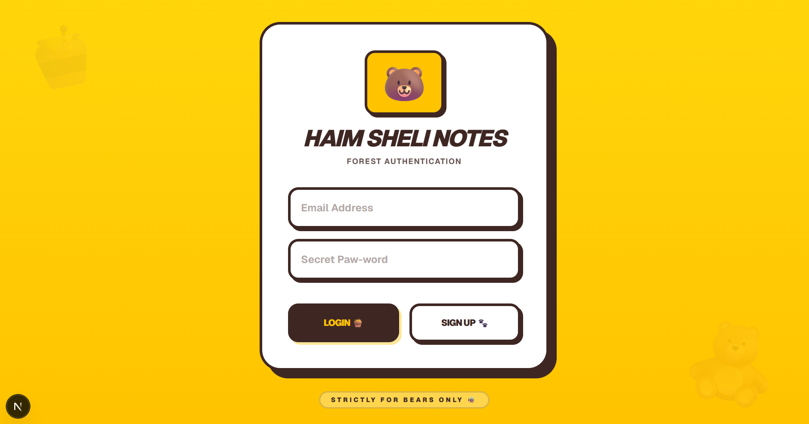
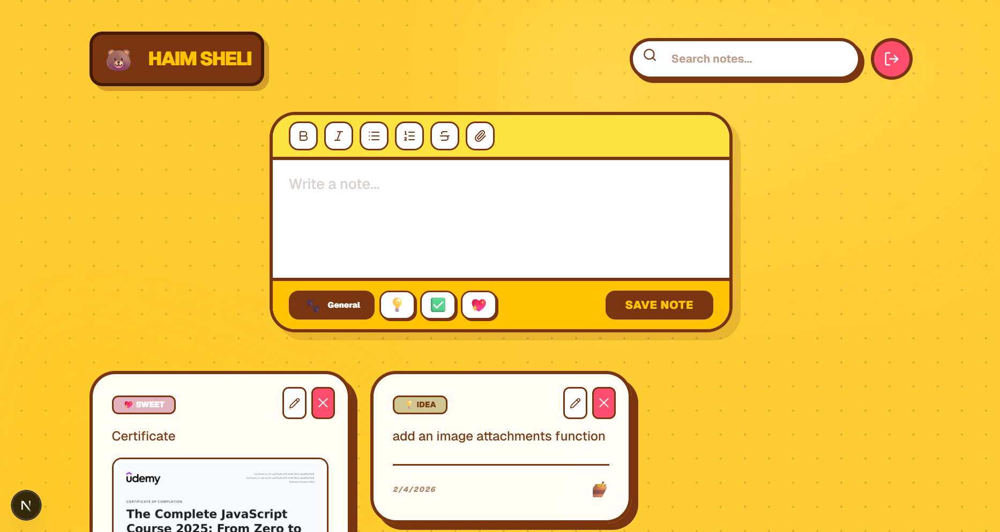
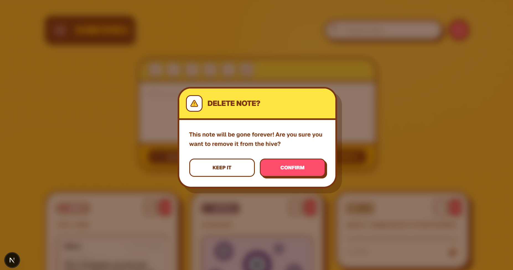

### Login


### Notes Home


### Delete Note Alert


---

## 🛠 Tech Stack

- **Frontend:** Next.js (App Router), React
- **Backend:** Supabase (Auth, Database, Storage)
- **Database:** PostgreSQL (via Supabase)
- **Styling:** Tailwind CSS
- **Markdown Rendering:** react-markdown + remark-gfm
- **Icons:** lucide-react

---

## 🧠 How It Works

1. Sign up or log in  
2. Create new notes or edit existing ones  
3. Organize notes into categories  
4. Use Markdown to format notes  
5. Attach files or images if needed  
6. Notes are saved securely in Supabase  

---

## 🧑‍💻 Installation & Setup

Clone the repository:

```bash
git clone https://github.com/tamar-natchkebia/note-taking-app.git
cd note-taking-app
